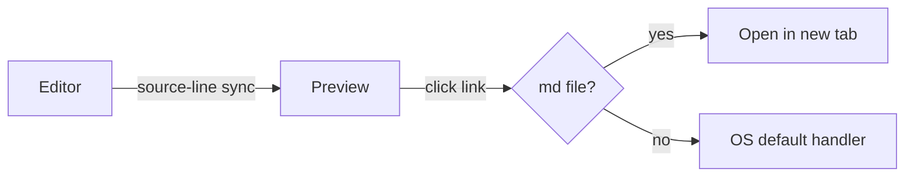
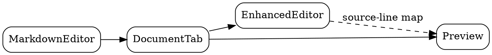

# Sample Document — Feature Showcase

Opening this file in the editor exercises every renderable feature. Each section below maps to a specific markdown extension configured in `markdown_editor._init_markdown()`.

[TOC]

## Inline text

Plain paragraph text with **bold**, *italic*, ***bold italic***, ~~strikethrough~~, and `inline code`. Lines in the same paragraph wrap softly
to the next line.

A second paragraph with a hard break at the end of this line,\
followed by a trailing line using the Markdown backslash break.

Keyboard hint via inline HTML: press <kbd>Ctrl</kbd>+<kbd>Shift</kbd>+<kbd>P</kbd> for the command palette.

## Lists

Unordered with nesting:

- First item
- Second item
  - Nested
    - Double-nested
- Third item

Ordered:

1. One
2. Two
   1. Two-a
   2. Two-b
3. Three

Task list:

- [x] Implement feature
- [x] Write regression test
- [ ] Update docs
- [ ] Ship it

Breakless list (no blank line before) handled by `BreaklessListExtension`:
- alpha
- beta
- gamma

## Blockquote

> Simple blockquote.
>
> > Nested blockquote.

## Horizontal rule

Above the rule.

---

Below the rule.

## Links and images

- Markdown link: [Anthropic](https://www.anthropic.com)
- Link with title: [Hover me](https://example.com "tooltip text")
- Bare URL: https://example.com
- Reference-style link: see [the spec][md-spec]
- Wiki link (bare): [[another-note]]
- Wiki link (with display text): [[another-note|a human-friendly label]]
- Image: 

[md-spec]: https://daringfireball.net/projects/markdown/

## Code

Fenced code with syntax highlighting (Python):

```python
def greet(name: str) -> str:
    """Return a friendly greeting."""
    return f"Hello, {name}!"

print(greet("world"))
```

Shell example:

```bash
mde export README.md -f pdf -o out.pdf
```

Plain fenced code (no language):

```
no highlighting here
just monospace text
```

## Tables

| Header 1 | Header 2 | Header 3 |
|----------|:--------:|---------:|
| Left     | Center   |    Right |
| Data     | Data     |     Data |
| 42       | ✓        |    99.99 |

## Callouts — GitHub syntax

> [!NOTE]
> Useful information that readers should pay attention to.

> [!TIP]
> Helpful advice for doing things better.

> [!IMPORTANT]
> Key information users need to know.

> [!WARNING]
> Urgent info that needs immediate user attention to avoid problems.

> [!CAUTION]
> Negative potential consequences of an action.

## Callouts — admonition syntax

!!! note "A titled note"
    Admonition callouts accept an optional title.

!!! tip
    Pro tip: every shortcut in the editor is remappable.

!!! warning
    Something to watch out for.

!!! bug
    Admonition supports exotic types too — `bug`, `danger`, `failure`, `question`, `abstract`, `example`, `quote`, `success`, `info`.

## Math (KaTeX / MathJax)

Inline: $E = mc^2$, $\forall x \in \mathbb{R}$, and $\sum_{i=1}^{n} i = \frac{n(n+1)}{2}$.

Block:

$$
\int_0^{\infty} e^{-x^2}\,dx = \frac{\sqrt{\pi}}{2}
$$

$$
\begin{pmatrix} a & b \\ c & d \end{pmatrix}
\begin{pmatrix} x \\ y \end{pmatrix}
=
\begin{pmatrix} ax + by \\ cx + dy \end{pmatrix}
$$

## Mermaid diagram



## Graphviz (dot)



## Definition list

markdown-editor
:   A Qt6 Markdown editor with live preview.

mde
:   Short CLI alias for `markdown-editor`.

## Abbreviation

The HTML spec is defined by the W3C.

*[HTML]: HyperText Markup Language
*[W3C]: World Wide Web Consortium

## Footnote

Here is a sentence with a footnote reference.[^1] And another using a named key.[^named]

[^1]: First footnote — appears at the bottom of the rendered document.
[^named]: Named footnotes keep the source readable.

---

End of sample.
