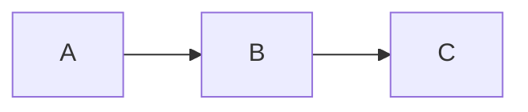
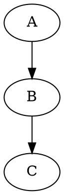

# mde — Markdown Editor

A feature-rich desktop Markdown editor built with Qt6 (PySide6). Live preview, wiki links, diagrams, project management, and export to HTML/PDF/DOCX.

Requires Python 3.11+.

## Features

- **Live preview** with synchronized scrolling
- **Multi-tab** editing with quick switching (Alt+1–9)
- **Wiki links** — `[[target]]` or `[[target|display]]` with Ctrl+click navigation
- **Diagrams** — Mermaid and Graphviz rendering in fenced code blocks
- **Math** — LaTeX via KaTeX (`$inline$` and `$$block$$`)
- **Callouts** — GitHub-style `> [!NOTE]`, `> [!WARNING]`, `> [!TIP]`, etc.
- **Task lists** — `- [x]` checkbox rendering
- **Code highlighting** — syntax-highlighted fenced code blocks
- **Export** — HTML, PDF, and DOCX (via Pandoc or built-in fallbacks)
- **Project sidebar** — file explorer, document outline, backlink references, project-wide search
- **Command palette** — Ctrl+Shift+P access to all commands
- **Document graph** — visualize link structure across project files
- **Link validation** — check for broken wiki links and references
- **File statistics** — word count, heading count, link count
- **Logseq mode** — read and render Logseq-flavored markdown
- **Code folding**, line numbers, word wrap, whitespace display
- **Find & replace** with regex support
- **62 keyboard shortcuts**, all customizable
- **Light and dark themes**
- **Fullscreen** and **read-only** modes
- **Linux desktop integration** — `.desktop` file and icon installation

## Install

```bash
pip install -e .
```

For full PDF/DOCX export quality, install [Pandoc](https://pandoc.org/):

```bash
# Ubuntu/Debian
sudo apt install pandoc texlive-xetex

# macOS
brew install pandoc

# Windows
choco install pandoc
```

For diagram support, install [Graphviz](https://graphviz.org/) and/or [Mermaid CLI](https://github.com/mermaid-js/mermaid-cli):

```bash
sudo apt install graphviz
npm install -g @mermaid-js/mermaid-cli
```

## Usage

```bash
mde                        # open a new document
mde file.md                # open a file
mde --project /path/to/dir # open a project folder
mde --theme dark           # override theme
mde --read-only file.md    # view-only mode
```

### Export

```bash
mde export file.md -f pdf -o output.pdf
mde export file.md -f html -o output.html --toc
mde export -p /project -f docx -o book.docx --page-breaks
```

### Document Graph

Generate a visual graph of wiki links across a project:

```bash
mde graph -p /project -o graph.svg
mde graph -p /project -o graph.png -f png --no-orphans
```

### Validate Links

```bash
mde validate -p /project
mde validate file.md --json
```

### File Statistics

```bash
mde stats file.md
mde stats -p /project --json
```

### Desktop Integration (Linux)

```bash
mde install-desktop        # register app and icons
mde install-autocomplete   # enable shell tab-completion
```

## Keyboard Shortcuts

| Action | Shortcut |
|---|---|
| New Tab | Ctrl+N |
| Open | Ctrl+O |
| Save | Ctrl+S |
| Close Tab | Ctrl+W |
| Find | Ctrl+F |
| Replace | Ctrl+R |
| Command Palette | Ctrl+Shift+P |
| Toggle Preview | Ctrl+Shift+V |
| Bold | Ctrl+B |
| Italic | Ctrl+I |
| Insert Link | Ctrl+K |
| Code | Ctrl+` |
| Insert Table | Ctrl+Shift+T |
| Heading Up | Ctrl+] |
| Heading Down | Ctrl+[ |
| Toggle Comment | Ctrl+/ |
| Fullscreen | F11 |
| Zoom In / Out | Ctrl++ / Ctrl+- |

All shortcuts are customizable in Settings.

## Markdown Extensions

**Callouts:**
```markdown
> [!NOTE]
> This is a note callout.

> [!WARNING]
> Something to watch out for.
```

**Mermaid diagrams:**
````markdown

````

**Graphviz:**
````markdown

````

**Math (KaTeX):**
```markdown
Inline: $E = mc^2$

Block:
$$
\int_0^\infty e^{-x} dx = 1
$$
```

**Wiki links:**
```markdown
Link to [[another-page]]
Link with [[another-page|custom text]]
```

## License

[MIT](LICENSE)
