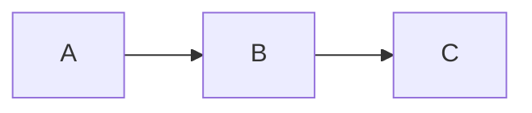
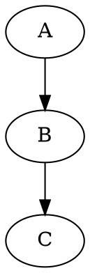

# mde — Markdown Editor

A feature-rich desktop Markdown editor built with Qt6 (PySide6). Live preview, wiki links, diagrams, project management, and export to HTML/PDF/DOCX.

Requires Python 3.11+.

## Features

- **Live preview** with bidirectional synchronized scrolling
- **Multi-tab** editing with quick switching (Alt+1–9) and session persistence (tabs and project restored across restarts)
- **Wiki links** — `[[target]]` or `[[target|display]]` with autocomplete and Ctrl+click navigation
- **Diagrams** — Mermaid and Graphviz rendering in fenced code blocks (cached; falls back to browser rendering)
- **Math** — LaTeX via KaTeX / MathJax (`$inline$` and `$$block$$`)
- **Callouts** — both GitHub `> [!NOTE]` and admonition `!!! note` syntaxes
- **Task lists** — `- [x]` checkbox rendering
- **Code highlighting** — syntax-highlighted fenced code blocks
- **Export** — HTML, PDF, DOCX (via Pandoc or built-in weasyprint/python-docx fallbacks)
- **Project sidebar** — file explorer, document outline, backlink references, project-wide regex search
- **Command palette** — Ctrl+Shift+P access to all commands
- **Document graph** — visualize link structure across project files, export to SVG/PNG/PDF
- **Link validation** — check for broken wiki links and references
- **File statistics** — word count, heading count, link count
- **Logseq mode** — read and render Logseq-flavored markdown
- **Snippets** — expandable templates (Ctrl+J) with searchable popup
- **Visual table editor** — Ctrl+Shift+T for a grid-based table builder
- **Find & replace** with regex support across editor and preview
- **Auto-pairs**, auto-indent, code folding, line numbers, word wrap, whitespace display
- **Image paste** — paste images from clipboard directly into the document
- **Autosave** (optional) and **external file-change detection** with non-modal reload bar
- **Preview pane copy / select-all** (Ctrl+C, Ctrl+A when preview is focused)
- **Preview typography** — per-element font control (Appearance settings tab)
- **Scroll-past-end** and **zoom** support in the editor
- **Recent files** menu
- **Customizable keyboard shortcuts** (all shortcuts remappable)
- **Light and dark themes**
- **Fullscreen** and **read-only** modes
- **Cross-platform desktop integration** — Linux `.desktop`, Windows `.lnk`, macOS `.app`

## Install

### Pre-built AppImage (Linux, no install required)

Download `MarkdownEditor-<version>-x86_64.AppImage` from the releases page, make it executable, run it:

```bash
chmod +x MarkdownEditor-*-x86_64.AppImage
./MarkdownEditor-*-x86_64.AppImage            # GUI
./MarkdownEditor-*-x86_64.AppImage file.md    # GUI with file
./MarkdownEditor-*-x86_64.AppImage stats file.md    # CLI subcommand
./MarkdownEditor-*-x86_64.AppImage --help           # CLI help
```

The bundled runtime includes everything the app needs (Qt, WebEngine, Python, all Python deps) plus an embedded FUSE implementation, so there is **no system prerequisite** on mainstream Linux distributions — including Ubuntu 22.04, Ubuntu 24.04, Debian 12, Fedora 38+, etc.

**If you see `Cannot mount AppImage, please check your FUSE setup`** (typically on WSL1, inside hardened containers, or a minimal chroot with no FUSE kernel support), run the AppImage with the extract-and-run fallback — it unpacks into a temp dir instead of mounting:

```bash
./MarkdownEditor-*-x86_64.AppImage --appimage-extract-and-run
```

Slightly slower cold-start, but works on any Linux that can execute a static ELF binary.

### From source (pip)

```bash
# Core install
pip install -e .

# With test dependencies
pip install -e ".[dev]"
```

### Dependencies

Installed automatically via pip:

- `PySide6`, `PySide6-Addons` — Qt6 bindings + QtWebEngine for the preview
- `markdown` — Markdown parsing
- `Pygments` — syntax highlighting
- `graphviz` — Python bindings for Graphviz
- `weasyprint` — PDF export fallback
- `python-docx` — DOCX export fallback
- `pydantic`, `email-validator` — data models / validation
- `argcomplete` — shell tab-completion for `mde`

Dev extras (`pip install -e ".[dev]"`):

- `pytest`, `pytest-qt`

### Optional external tools

These system tools enable additional rendering features. The editor works without them but with reduced functionality. Paths are configurable in **Settings → Tools**.

| Tool | Purpose | Install | Without it |
|---|---|---|---|
| **Pandoc** | High-quality PDF/DOCX export with LaTeX | `apt install pandoc texlive-xetex` | Falls back to weasyprint (PDF) / python-docx (DOCX) |
| **Graphviz** (`dot`) | Native rendering of ` ```dot ` / ` ```graphviz ` blocks | `apt install graphviz` | Falls back to browser-side viz.js |
| **Mermaid CLI** (`mmdc`) | Native rendering of ` ```mermaid ` blocks to SVG | `npm install -g @mermaid-js/mermaid-cli` | Falls back to browser-side mermaid.js (requires internet) |

Quick install commands:

```bash
# Ubuntu/Debian — all tools at once
sudo apt install pandoc texlive-xetex graphviz
npm install -g @mermaid-js/mermaid-cli

# macOS
brew install pandoc graphviz
npm install -g @mermaid-js/mermaid-cli

# Windows
choco install pandoc graphviz
npm install -g @mermaid-js/mermaid-cli

# conda / mamba
mamba install -c conda-forge pandoc graphviz nodejs
npm install -g @mermaid-js/mermaid-cli
```

## Usage

Two entry points are installed as console scripts: `markdown-editor` (full name) and `mde` (short alias). They do the same thing; the rest of this README uses `mde`.

```bash
mde                        # open editor with previous session
mde file.md                # open a file
mde -p /path/to/dir        # open a project folder (also --project)
mde --new                  # start with a new untitled document
mde --line 42 file.md      # open file and jump to line 42
mde --theme dark           # override theme for this run
mde --read-only file.md    # view-only mode
mde --config /path/to/dir  # use alternate config directory
mde --new-session          # use default settings in memory only
mde --reset                # delete all config files and start clean
mde -v                     # verbose output (-q for quiet)
mde --version              # print version
```

### Export

```bash
mde export file.md -f pdf -o output.pdf
mde export file.md -f html -o output.html --toc
mde export -p /project -f docx -o book.docx --page-breaks
```

### Document Graph

Generate a visual graph of wiki links across a project:

```bash
mde graph -p /project -o graph.svg
mde graph -p /project -o graph.png -f png --no-orphans
```

### Validate Links

```bash
mde validate -p /project
mde validate file.md --json
```

### File Statistics

```bash
mde stats file.md
mde stats -p /project --json
```

### Desktop Integration

```bash
mde install-desktop        # register app and icons (Linux, macOS, Windows)
mde uninstall-desktop      # remove desktop integration
mde install-autocomplete   # enable shell tab-completion (bash, zsh, fish)
mde uninstall-autocomplete # remove shell tab-completion
```

### Project Export (GUI)

In addition to `mde export` on the command line, multiple files can be exported from the running editor:

1. Open a project folder (Ctrl+Shift+O, or from the Project panel).
2. In the Project panel, click **Export**.
3. Tick the files to include — drag to reorder.
4. Choose a format (HTML, PDF, DOCX, Markdown).
5. Options: Include Table of Contents, Insert page breaks between files, Use Pandoc (for LaTeX PDF).

## Keyboard Shortcuts

Defaults shown below. Every shortcut is remappable in **Settings → Shortcuts**, and defaults are platform-aware (Ctrl+N, Ctrl+S, etc. use `QKeySequence.StandardKey` and resolve correctly on macOS/Linux/Windows). Standard OS shortcuts (Cut/Copy/Paste/Select All, Tab/Shift+Tab to indent) are omitted.

### File

| Shortcut | Action |
|---|---|
| Ctrl+N | New file |
| Ctrl+O | Open file |
| Ctrl+Shift+O | Open project folder |
| Ctrl+S | Save |
| Ctrl+Shift+S | Save as |
| Ctrl+W | Close tab |
| Ctrl+Q | Quit |

### Edit

| Shortcut | Action |
|---|---|
| Ctrl+Z | Undo |
| Ctrl+Shift+Z | Redo |
| Ctrl+F | Find |
| Ctrl+R | Replace |
| Ctrl+G | Go to line |
| Ctrl+/ | Toggle comment |
| Ctrl+Shift+D | Duplicate line |
| Ctrl+Shift+K | Delete line |
| Alt+Up | Move line up |
| Alt+Down | Move line down |

### Markdown formatting

| Shortcut | Action |
|---|---|
| Ctrl+B | Bold |
| Ctrl+I | Italic |
| Ctrl+K | Insert link |
| Ctrl+Shift+I | Insert image |
| Ctrl+` | Inline code |
| Ctrl+] | Increase heading level |
| Ctrl+[ | Decrease heading level |
| Ctrl+Shift+T | Insert table |
| Ctrl+J | Insert snippet |

### View

| Shortcut | Action |
|---|---|
| Ctrl+Shift+P | Command palette |
| Ctrl+Shift+V | Toggle preview |
| Ctrl+Alt+O | Toggle outline panel |
| Ctrl+Shift+E | Toggle project panel |
| Ctrl+Shift+R | Toggle references panel |
| Ctrl+Shift+F | Toggle search panel |
| Ctrl+Shift+B | Toggle sidebar |
| Ctrl+Shift+L | Toggle line numbers |
| Alt+Z | Toggle word wrap |
| Ctrl+Alt+W | Toggle whitespace display |
| Ctrl+Shift+[ | Fold all |
| Ctrl+Shift+] | Unfold all |
| Ctrl+Alt+L | Toggle Logseq mode |
| F5 | Refresh preview |
| F11 | Fullscreen |
| Ctrl++ / Ctrl+- / Ctrl+0 | Zoom in / out / reset |

### Navigation

| Shortcut | Action |
|---|---|
| Ctrl+Tab | Next tab |
| Ctrl+Shift+Tab | Previous tab |
| Alt+1 … Alt+9 | Jump to tab 1-9 |
| F3 | Find next |
| Shift+F3 | Find previous |

## Markdown Extensions

**Callouts** (both syntaxes are supported):

GitHub syntax — supports `NOTE`, `TIP`, `IMPORTANT`, `WARNING`, `CAUTION`:

```markdown
> [!NOTE]
> This is a note callout.

> [!WARNING]
> Something to watch out for.
```

Admonition syntax — supports `note`, `info`, `tip`, `success`, `example`, `important`, `abstract`, `question`, `warning`, `quote`, `caution`, `danger`, `failure`, `bug`:

```markdown
!!! note "Optional Title"
    This is a note callout.

!!! warning
    Something to watch out for.
```

**Mermaid diagrams:**
````markdown

````

**Graphviz:**
````markdown

````

**Math (KaTeX):**
```markdown
Inline: $E = mc^2$

Block:
$$
\int_0^\infty e^{-x} dx = 1
$$
```

**Wiki links:**
```markdown
[[another-page]]                  # resolves to another-page.md
[[folder/page]]                   # resolves to folder/page.md
[[another-page|custom text]]      # links to another-page.md, shows "custom text"
```

- Type `[[` in the editor to trigger an autocomplete popup of project files.
- Ctrl+click a wiki link to navigate to the target file.
- Targets without an extension automatically get `.md` appended.

## Configuration

Settings live under `~/.config/markdown-editor/`:

- `settings.json` — editor preferences
- `shortcuts.json` — customised keyboard shortcuts (only deviations from defaults are saved)
- Session state (open tabs, last project, sidebar state)

The **Settings** dialog (accessible from the Edit menu or the command palette) has these tabs:

- **Editor** — font, tab size/indentation, line numbers, word wrap, current-line highlight, whitespace display, auto-pairs, auto-indent, autosave, scroll-past-end
- **View** — theme (light/dark), scroll sync, show/hide editor or preview pane, Logseq mode
- **Appearance** — per-element preview font overrides (body, headings, inline code, line height)
- **Files** — show hidden (dotfile) files, external file-change detection
- **Tools** — custom paths to `pandoc`, `dot`, `mmdc`
- **Shortcuts** — remap any keyboard shortcut

Pass `--config DIR` to use an alternate config directory, `--new-session` to keep settings in memory only, or `--reset` to wipe config and start clean.

## Project Structure

```
src/markdown_editor/markdown6/
├── markdown_editor.py         # Main QMainWindow
├── markdown_editor_cli.py     # `mde` CLI entry point and subcommands
├── actions.py                 # Data-driven menu/shortcut/palette registry
├── enhanced_editor.py         # Text editor widget (QPlainTextEdit subclass)
├── syntax_highlighter.py      # Markdown syntax highlighting
├── theme.py                   # ThemeColors + StyleSheets factories
├── export_service.py          # PDF/DOCX/HTML export
├── graphviz_service.py        # Graphviz rendering (cached)
├── mermaid_service.py         # Mermaid rendering (cached)
├── tool_paths.py              # External tool path resolution
├── snippets.py                # Snippet manager and popup
├── searchable_popup.py        # Base class for searchable popups
├── logger.py                  # Colored logger utilities
├── temp_files.py              # Tracked temp files, atomic_write()
├── file_tree_widget.py        # Checkbox file-tree widget (shared)
├── project_manager.py         # ProjectPanel (top-level for import stability)
│
├── app_context/               # Settings, shortcuts, session state (DI facade)
├── components/                # Widgets: panels, dialogs, activity bar, sidebar
├── extensions/                # Markdown extensions (callouts, diagrams, math, …)
└── templates/                 # Preview HTML templates
```

See `src/markdown_editor/markdown6/DEVELOPMENT.md` for a full module reference.

## License

[MIT](LICENSE)
