# Diagram stress test - 20 interleaved diagrams

Ten Mermaid and ten Graphviz diagrams, interleaved. Every diagram is distinct
in both topic and syntax, and none is a toy one-liner.

---

## 1. Mermaid - release pipeline

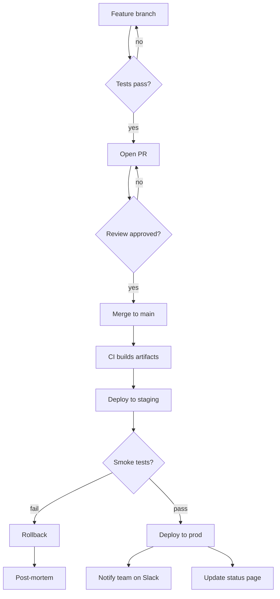

## 2. Graphviz - microservices dependency graph

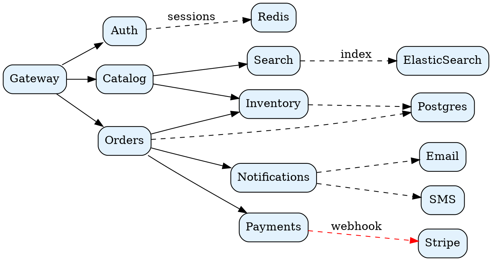

## 3. Mermaid - OAuth2 authorization code flow

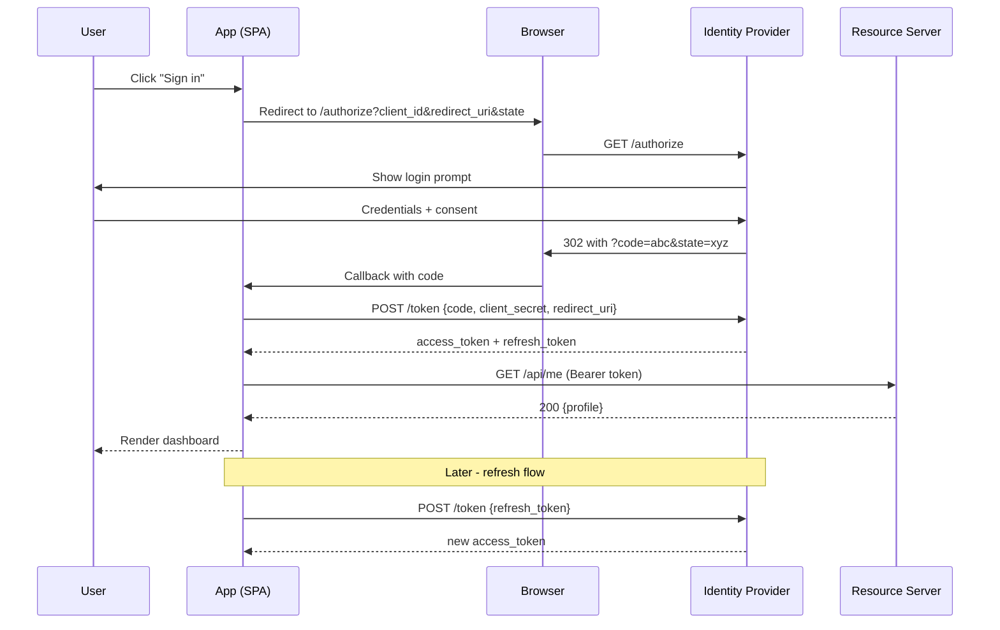

## 4. Graphviz - vending-machine finite state machine

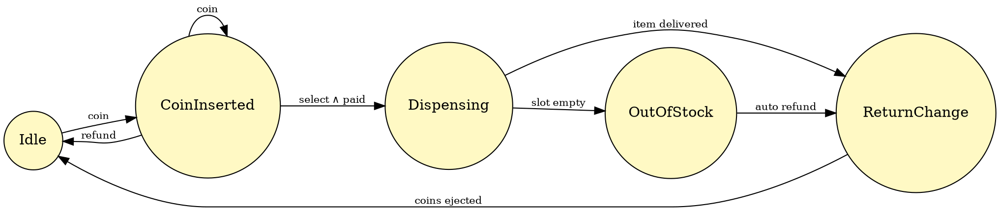

## 5. Mermaid - e-commerce domain class diagram

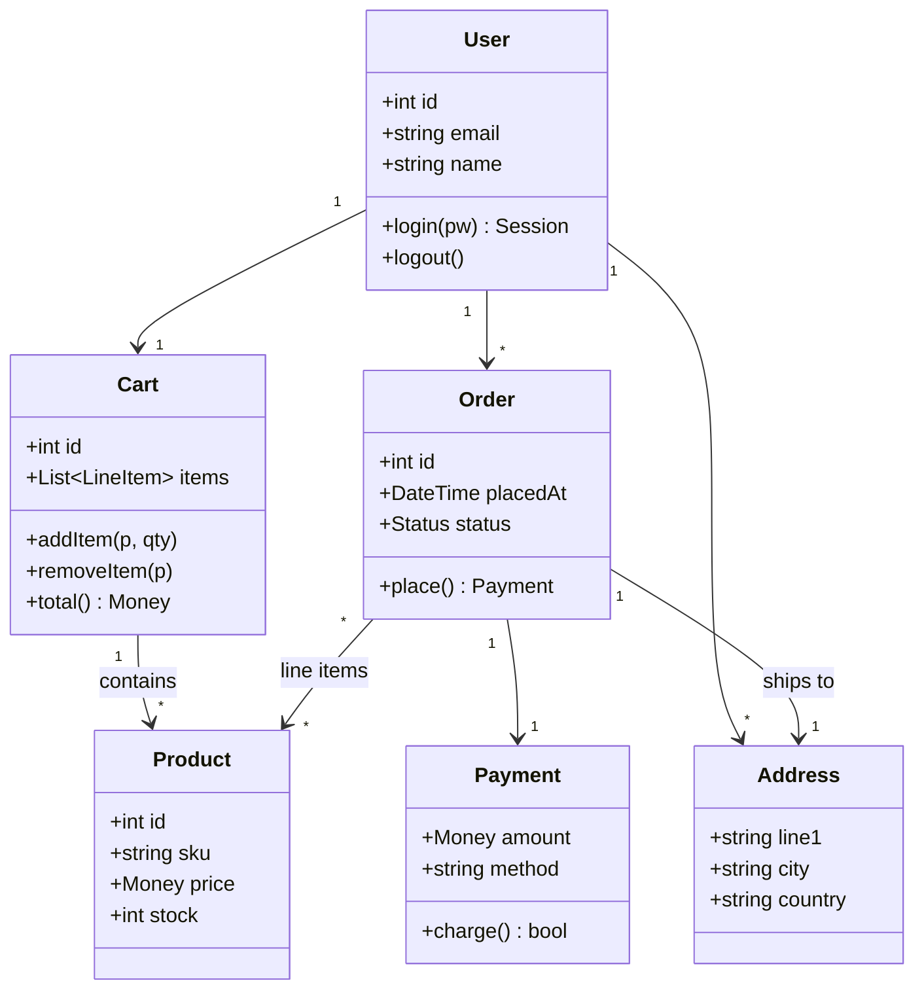

## 6. Graphviz - compiler pipeline

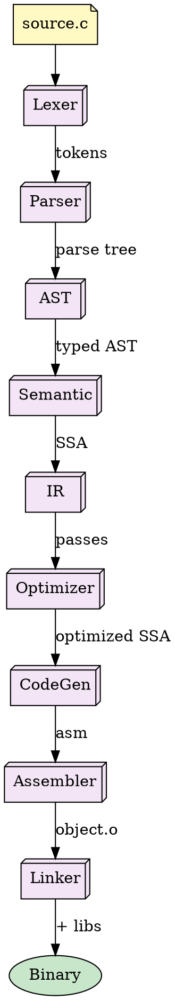

## 7. Mermaid - TCP connection state diagram

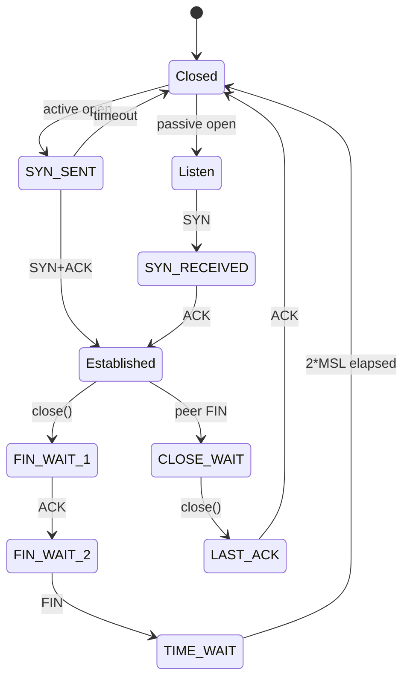

## 8. Graphviz - organization chart

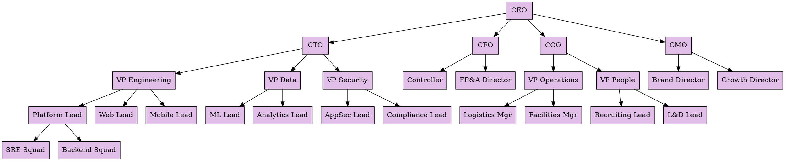

## 9. Mermaid - library ER diagram

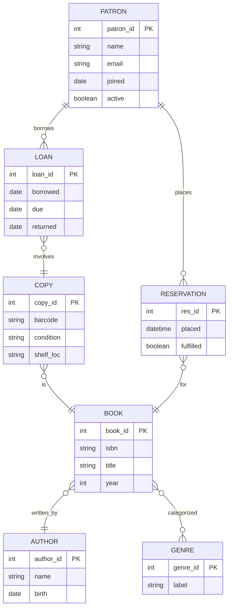

## 10. Graphviz - C build dependency tree

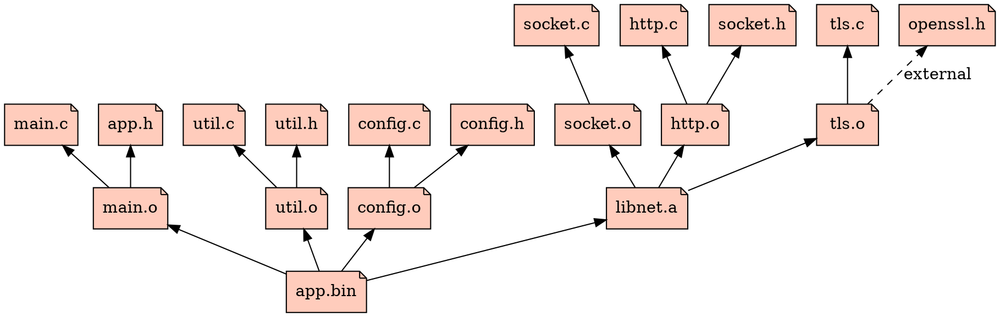

## 11. Mermaid - product launch Gantt

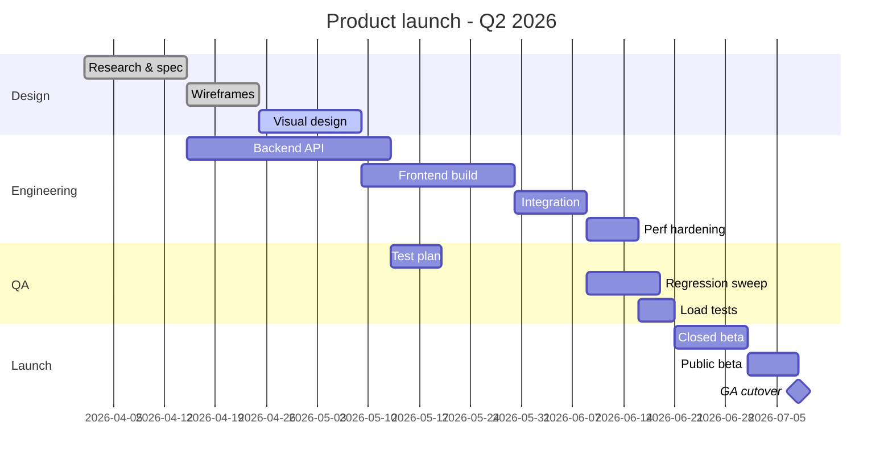

## 12. Graphviz - datacenter network topology

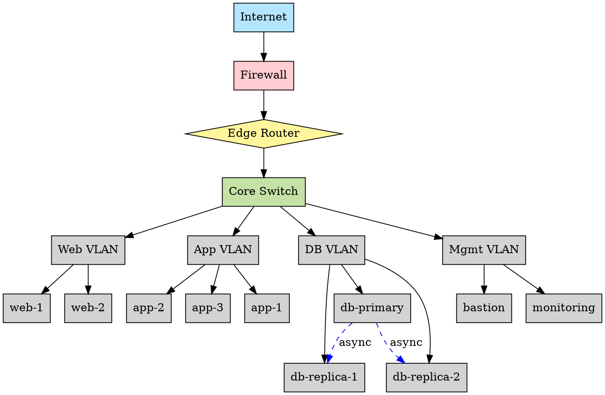

## 13. Mermaid - source LOC pie chart

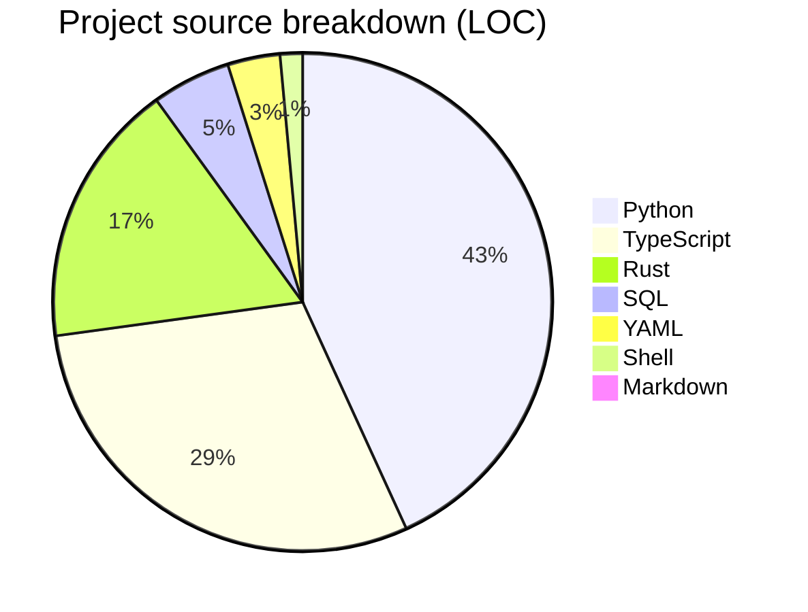

## 14. Graphviz - loan-approval decision tree

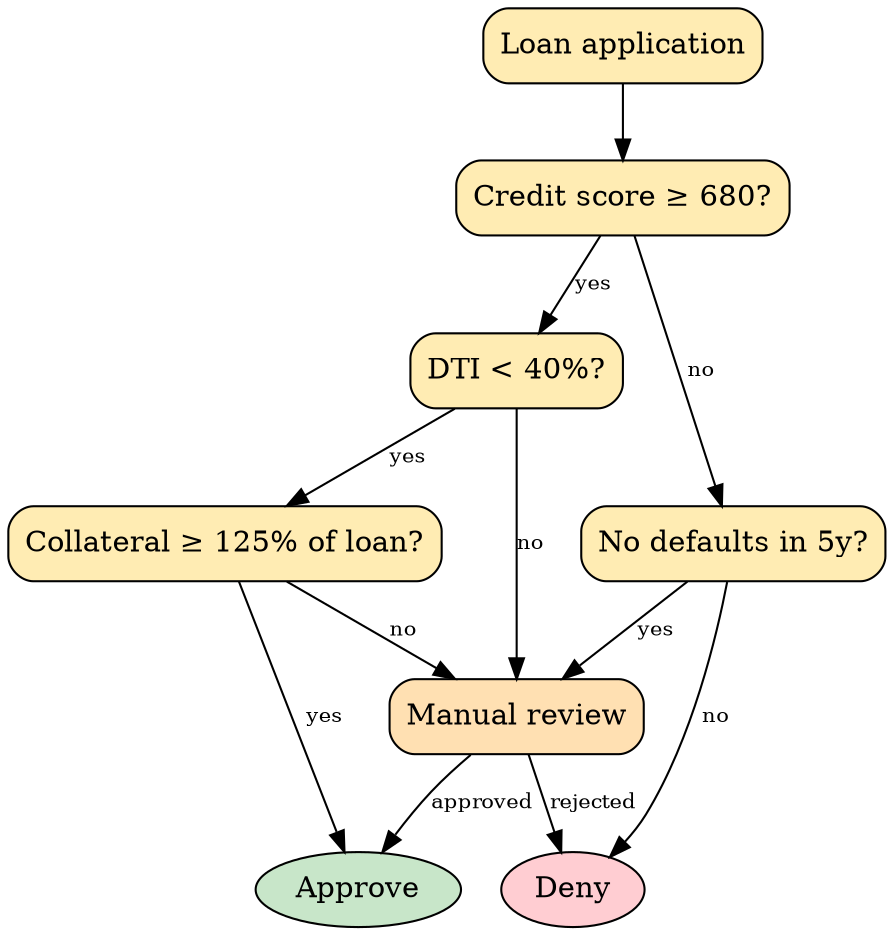

## 15. Mermaid - user onboarding journey

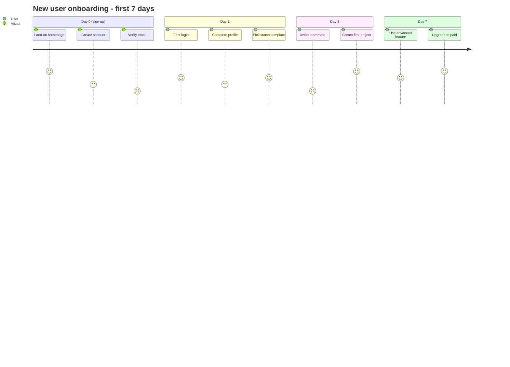

## 16. Graphviz - ETL data flow diagram

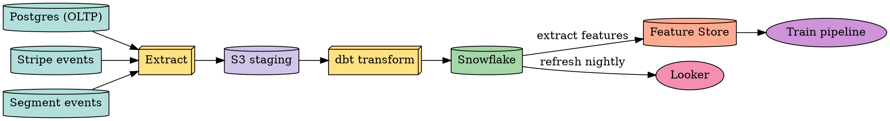

## 17. Mermaid - git branching + hotfix

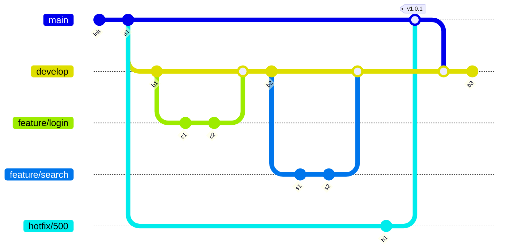

## 18. Graphviz - class inheritance hierarchy

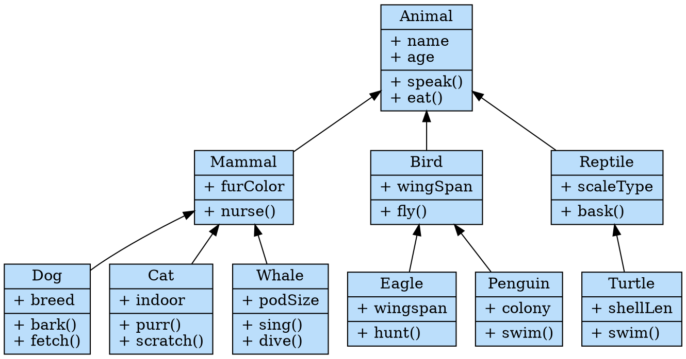

## 19. Mermaid - HTTP error handling flow

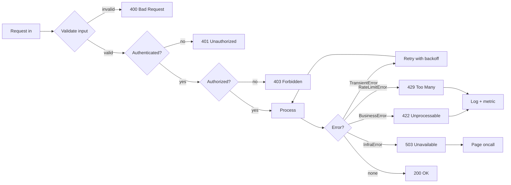

## 20. Graphviz - PID control feedback loop

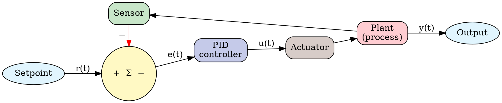
