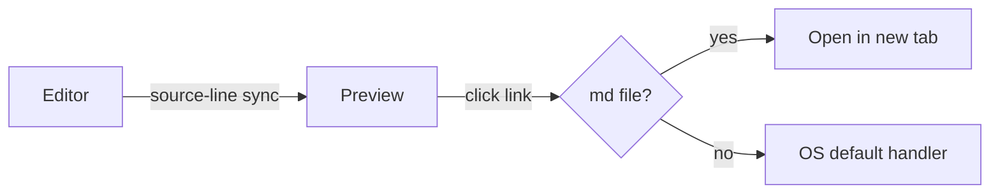

# Sample Document — Feature Showcase

Opening this file in the editor exercises every renderable feature. Each section below maps to a specific markdown extension configured in `markdown_editor._init_markdown()`.

[TOC]

## Inline text

Plain paragraph text with **bold**, *italic*, ***bold italic***, ~~strikethrough~~, and `inline code`. Lines in the same paragraph wrap softly
to the next line.

A second paragraph with a hard break at the end of this line,\
followed by a trailing line using the Markdown backslash break.

Keyboard hint via inline HTML: press <kbd>Ctrl</kbd>+<kbd>Shift</kbd>+<kbd>P</kbd> for the command palette.

## Lists

Unordered with nesting:

- First item
- Second item
  - Nested
    - Double-nested
- Third item

Ordered:

1. One
2. Two
   1. Two-a
   2. Two-b
3. Three

Task list:

- [x] Implement feature
- [x] Write regression test
- [ ] Update docs
- [ ] Ship it

Breakless list (no blank line before) handled by `BreaklessListExtension`:
- alpha
- beta
- gamma

## Blockquote

> Simple blockquote.
>
> > Nested blockquote.

## Horizontal rule

Above the rule.

---

Below the rule.

## Links and images

- Markdown link: [Anthropic](https://www.anthropic.com)
- Link with title: [Hover me](https://example.com "tooltip text")
- Bare URL: https://example.com
- Reference-style link: see [the spec][md-spec]
- Wiki link (bare): [[another-note]]
- Wiki link (with display text): [[another-note|a human-friendly label]]
- Image (remote URL): 

[md-spec]: https://daringfireball.net/projects/markdown/

### Local image files

These exercise the preview's local-file image rendering — a raster format (PNG) and a vector format (SVG), resolved relative to the markdown file.


## Code

### Python — function with type hints and f-strings

```python
def greet(name: str, punctuation: str = "!") -> str:
    """Return a friendly greeting.

    >>> greet("world")
    'Hello, world!'
    """
    return f"Hello, {name}{punctuation}"


if __name__ == "__main__":
    print(greet("world"))
    print(greet("mde", punctuation="..."))
```

### Python — dataclass, decorators, classmethods, properties

```python
from __future__ import annotations

from dataclasses import dataclass, field
from datetime import datetime
from typing import ClassVar


@dataclass(frozen=True, slots=True)
class Document:
    """An immutable document record with a unique auto-assigned id."""

    title: str
    body: str
    tags: list[str] = field(default_factory=list)
    created_at: datetime = field(default_factory=datetime.utcnow)

    _next_id: ClassVar[int] = 0
    id: int = field(init=False)

    def __post_init__(self) -> None:
        # object.__setattr__ because the dataclass is frozen
        object.__setattr__(self, "id", Document._next_id)
        Document._next_id += 1

    @property
    def word_count(self) -> int:
        return len(self.body.split())

    @classmethod
    def from_markdown(cls, raw: str) -> Document:
        title, _, body = raw.partition("\n")
        return cls(title=title.lstrip("# ").strip(), body=body.strip())


doc = Document.from_markdown("# Hello\n\nFirst paragraph with some words.")
assert doc.word_count == 5
print(f"doc #{doc.id}: {doc.title!r} ({doc.word_count} words)")
```

### Python — async I/O, context managers, comprehensions, numbers

```python
import asyncio
from contextlib import asynccontextmanager
from pathlib import Path

MAX_CONCURRENT = 8          # plain int
TIMEOUT_SEC    = 2.5        # float
MAGIC_BYTES    = 0xDEADBEEF  # hex literal
GOLDEN_RATIO   = 1.618_033_988_749  # underscores-in-numbers


@asynccontextmanager
async def limiter(n: int):
    sem = asyncio.Semaphore(n)
    try:
        yield sem
    finally:
        # drain pending permits
        while sem._value < n:
            sem.release()


async def read_first_line(path: Path, sem: asyncio.Semaphore) -> tuple[Path, str | None]:
    async with sem:
        try:
            with open(path, encoding="utf-8") as fp:
                return path, fp.readline().rstrip("\n")
        except (OSError, UnicodeDecodeError) as exc:
            print(f"skip {path}: {exc!r}")
            return path, None


async def main(root: Path) -> dict[Path, str]:
    md_files = [p for p in root.rglob("*.md") if p.is_file()]
    async with limiter(MAX_CONCURRENT) as sem:
        results = await asyncio.gather(*(read_first_line(p, sem) for p in md_files))
    return {p: line for p, line in results if line is not None}


if __name__ == "__main__":
    headlines = asyncio.run(main(Path(".")))
    for path, line in sorted(headlines.items()):
        print(f"{path}: {line}")
```

### Shell

```bash
# Export the project to PDF via pandoc, with a TOC and page breaks
mde export -p ./docs -f pdf -o out.pdf --toc --page-breaks

# Validate every wiki link in the project and print JSON
mde validate -p ./docs --json | jq '.broken'
```

### Plain fenced code (no language — monospace only, no highlighting)

```
no highlighting here
just monospace text
```

## Tables

| Header 1 | Header 2 | Header 3 |
|----------|:--------:|---------:|
| Left     | Center   |    Right |
| Data     | Data     |     Data |
| 42       | ✓        |    99.99 |

## Callouts — GitHub syntax

> [!NOTE]
> Useful information that readers should pay attention to.

> [!TIP]
> Helpful advice for doing things better.

> [!IMPORTANT]
> Key information users need to know.

> [!WARNING]
> Urgent info that needs immediate user attention to avoid problems.

> [!CAUTION]
> Negative potential consequences of an action.

## Callouts — admonition syntax

!!! note "A titled note"
    Admonition callouts accept an optional title.

!!! tip
    Pro tip: every shortcut in the editor is remappable.

!!! warning
    Something to watch out for.

!!! bug
    Admonition supports exotic types too — `bug`, `danger`, `failure`, `question`, `abstract`, `example`, `quote`, `success`, `info`.

## Math (KaTeX / MathJax)

Inline: $E = mc^2$, $\forall x \in \mathbb{R}$, and $\sum_{i=1}^{n} i = \frac{n(n+1)}{2}$.

Block:

$$
\int_0^{\infty} e^{-x^2}\,dx = \frac{\sqrt{\pi}}{2}
$$

$$
\begin{pmatrix} a & b \\ c & d \end{pmatrix}
\begin{pmatrix} x \\ y \end{pmatrix}
=
\begin{pmatrix} ax + by \\ cx + dy \end{pmatrix}
$$

## Mermaid diagram



## Graphviz (dot)


## Definition list

markdown-editor
:   A Qt6 Markdown editor with live preview.

mde
:   Short CLI alias for `markdown-editor`.

## Abbreviation

The HTML spec is defined by the W3C.

*[HTML]: HyperText Markup Language
*[W3C]: World Wide Web Consortium

## Footnote

Here is a sentence with a footnote reference.[^1] And another using a named key.[^named]

[^1]: First footnote — appears at the bottom of the rendered document.
[^named]: Named footnotes keep the source readable.

---

End of sample.
