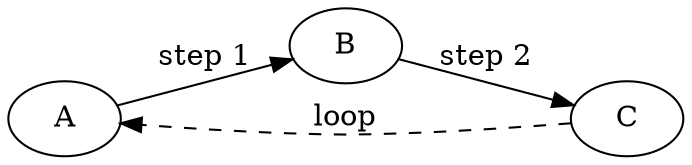
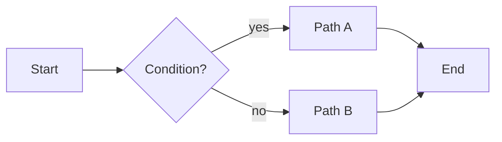

# Fenced-code syntax highlighting

The editor paints the body of a fenced code block according to its
language tag. Any language [Pygments](https://pygments.org) knows is
supported automatically — python, javascript, rust, haskell, prolog,
scheme, fortran, cobol, apl, the lot.

Nine colour categories are used: **keyword**, **type**, **string**,
**number**, **comment**, **function**, **class**, **operator**,
**decorator**. Unknown languages fall back to the default code-block
colour without per-token highlighting.

This file exists as a showcase / smoke test. Open it in the editor and
every block below should render with distinct colours.

## Python — multi-line docstrings carry state

State flows across blank lines, so the whole docstring stays
string-coloured even though each line is highlighted independently.

```python
from dataclasses import dataclass


@dataclass(frozen=True)
class Point:
    """A 2D point.

    Multi-line docstrings like this one are the canonical
    case where editor-side highlighting needs to remember
    that it's inside a string between calls.
    """

    x: float
    y: float

    def distance_to(self, other: "Point") -> float:
        # Comment on a single line
        dx = self.x - other.x
        dy = self.y - other.y
        return (dx ** 2 + dy ** 2) ** 0.5
```

## Rust — nested block comments

Rust's `/* /* */ */` can nest arbitrarily deep. The lexer tracks the
nesting level, and so do we (for free).

```rust
fn factorial(n: u64) -> u64 {
    /* Outer comment.
       /* This comment is nested inside. */
       We're still in the outer one here.
    */
    match n {
        0 | 1 => 1,
        _ => n * factorial(n - 1),
    }
}
```

## JavaScript — template literals across lines

Backtick strings with `${…}` interpolation span as many lines as you
want; they stay string-coloured the whole way through.

```javascript
function greet(name) {
    const greeting = `Hello, ${name}!
This line is still inside the template literal.
And so is this one.`;
    return greeting;
}
```

## Prolog — single- and multi-line comments

```prolog
% A Prolog predicate: ancestor/2
ancestor(X, Y) :- parent(X, Y).
ancestor(X, Y) :-
    parent(X, Z),
    /* This is a multi-line
       block comment.
       It spans three lines. */
    ancestor(Z, Y).
```

## Scheme — `#|...|#` block comments

```scheme
(define (fib n)
  ;; A line comment
  #| A block comment
     that spans
     several lines. |#
  (if (< n 2)
      n
      (+ (fib (- n 1)) (fib (- n 2)))))
```

## Go, C, C++, Java, C#

```go
package main

import "fmt"

func main() {
    // line comment
    fmt.Println("Hello, Go!")
}
```

```c
#include <stdio.h>

int main(void) {
    /* block comment */
    printf("Hello, C!\n");
    return 0;
}
```

```cpp
#include <iostream>

int main() {
    std::cout << "Hello, C++!" << std::endl;
    return 0;
}
```

```java
public class Hello {
    public static void main(String[] args) {
        System.out.println("Hello, Java!");
    }
}
```

```csharp
using System;

class Program {
    static void Main() {
        Console.WriteLine("Hello, C#!");
    }
}
```

## TOML — triple-quoted multi-line strings

```toml
[package]
name = "example"
version = "0.1.0"
description = """
A TOML block string
spanning several lines.
"""
```

## SQL

```sql
SELECT u.name, COUNT(o.id) AS order_count
  FROM users u
  LEFT JOIN orders o ON o.user_id = u.id
 WHERE u.active = TRUE
 GROUP BY u.name
 ORDER BY order_count DESC;
```

## YAML, JSON, HTML, CSS

```yaml
name: build
on: [push, pull_request]
jobs:
  test:
    runs-on: ubuntu-latest
    steps:
      - uses: actions/checkout@v4
      - run: pytest
```

```json
{
  "name": "example",
  "version": "1.0.0",
  "dependencies": {
    "react": "^18.0.0"
  }
}
```

```html
<!DOCTYPE html>
<html>
<head>
    <title>Example</title>
</head>
<body>
    <h1>Hello, world</h1>
    <!-- HTML comment -->
</body>
</html>
```

```css
.button {
    background: #0969da;
    color: white;
    padding: 8px 16px;
    border-radius: 4px;
    /* block comment */
}
```

## Bash

```bash
#!/usr/bin/env bash
set -euo pipefail

greet() {
    local name="${1:-world}"
    echo "Hello, ${name}!"
}

for arg in "$@"; do
    greet "$arg"
done
```

## Languages with non-standard Pygments lexer flavours

Pygments has three lexer "shapes": the common `RegexLexer` (most
languages), `ExtendedRegexLexer` (uses 3-arg callbacks and a
lexer-specific context object — yaml, ruby, html, php, haml, pug),
and hand-rolled `Lexer` subclasses that don't share `RegexLexer`'s
state model at all (json, erb). All three render correctly here.

## Ruby

```ruby
class Greeter
  def initialize(name = "world")
    @name = name
  end

  def greet
    puts "Hello, #{@name}!"
  end
end

Greeter.new.greet
```

## PHP

```php
<?php
function fizzbuzz(int $n): string {
    if ($n % 15 === 0) return "FizzBuzz";
    if ($n % 3 === 0)  return "Fizz";
    if ($n % 5 === 0)  return "Buzz";
    return (string) $n;
}

for ($i = 1; $i <= 15; $i++) {
    echo fizzbuzz($i) . "\n";
}
```

## ERB

```erb
<h1>Hello, <%= @user.name %>!</h1>
<ul>
<% @items.each do |item| %>
  <li><%= item %></li>
<% end %>
</ul>
```

## Haml

```haml
!!! 5
%html
  %head
    %title Hello, Haml
  %body
    %h1.greeting Hello, #{@name}!
    - if @logged_in
      %p Welcome back.
    - else
      %p= link_to "Sign in", "/login"
```

## Slim

```slim
doctype html
html
  head
    title Hello, Slim
  body
    h1.greeting Hello, #{@name}!
    - if @logged_in
      p Welcome back.
    - else
      p= link_to "Sign in", "/login"
```

## Pug

```pug
doctype html
html
  head
    title= pageTitle
  body
    h1.greeting Hello, #{name}!
    if loggedIn
      p Welcome back.
    else
      p
        a(href="/login") Sign in
```

## Sass

```sass
$primary: #0969da
$radius: 4px

.button
  background: $primary
  color: white
  border-radius: $radius
  &:hover
    background: darken($primary, 10%)
```

## Terraform

```terraform
terraform {
  required_providers {
    aws = {
      source  = "hashicorp/aws"
      version = "~> 5.0"
    }
  }
}

resource "aws_s3_bucket" "example" {
  bucket = "my-tf-example-bucket"
  tags = {
    Name        = "Example"
    Environment = "Dev"
  }
}
```

## Crystal

```crystal
class Greeter
  getter name : String

  def initialize(@name : String); end

  def greet
    puts "Hello, #{@name}!"
  end
end

Greeter.new("World").greet
```

## XML

```xml
<?xml version="1.0" encoding="UTF-8"?>
<config>
  <server host="localhost" port="8080">
    <database>postgres</database>
    <!-- inline comment -->
  </server>
</config>
```

## Makefile

```makefile
CC := gcc
CFLAGS := -Wall -O2

all: hello

hello: hello.c
	$(CC) $(CFLAGS) -o $@ $<

clean:
	rm -f hello

.PHONY: all clean
```

## Dockerfile

```dockerfile
FROM python:3.12-slim

WORKDIR /app
COPY requirements.txt .
RUN pip install --no-cache-dir -r requirements.txt
COPY . .

CMD ["python", "-m", "myapp"]
```

## Kotlin

```kotlin
fun main() {
    val greeting = "Hello, world"
    repeat(3) { i ->
        println("$greeting #${i + 1}")
    }
}
```

## Swift

```swift
import Foundation

struct Point {
    let x: Double
    let y: Double

    func distance(to other: Point) -> Double {
        let dx = x - other.x
        let dy = y - other.y
        return (dx * dx + dy * dy).squareRoot()
    }
}
```

## Elixir

```elixir
defmodule Fib do
  def at(0), do: 0
  def at(1), do: 1
  def at(n) when n > 1, do: at(n - 1) + at(n - 2)
end

IO.puts Fib.at(10)
```

## Lua

```lua
local function greet(name)
    name = name or "world"
    print("Hello, " .. name .. "!")
end

for _, who in ipairs({"alice", "bob"}) do
    greet(who)
end
```

## R

```r
fib <- function(n) {
  if (n < 2) return(n)
  return(fib(n - 1) + fib(n - 2))
}

sapply(0:10, fib)
```

## Julia

```julia
function fib(n::Int)
    n < 2 ? n : fib(n - 1) + fib(n - 2)
end

[fib(i) for i in 0:10]
```

## Dart

```dart
void main() {
  final greeting = 'Hello, world';
  for (var i = 1; i <= 3; i++) {
    print('$greeting #$i');
  }
}
```

## Nim

```nim
proc fib(n: int): int =
  if n < 2: n
  else: fib(n - 1) + fib(n - 2)

for i in 0..10:
  echo fib(i)
```

## Zig

```zig
const std = @import("std");

pub fn main() !void {
    const stdout = std.io.getStdOut().writer();
    try stdout.print("Hello, {s}!\n", .{"world"});
}
```

## OCaml

```ocaml
let rec fib = function
  | 0 -> 0
  | 1 -> 1
  | n -> fib (n - 1) + fib (n - 2)

let () = Printf.printf "%d\n" (fib 10)
```

## Clojure

```clojure
(defn fib [n]
  (if (< n 2)
    n
    (+ (fib (- n 1)) (fib (- n 2)))))

(map fib (range 11))
```

## Python REPL

```pycon
>>> from datetime import date
>>> today = date.today()
>>> today.year
2026
>>> [x ** 2 for x in range(5)]
[0, 1, 4, 9, 16]
```

## Shell session

```console
$ git status
On branch master
nothing to commit, working tree clean
$ uname -a
Linux box 6.8.0 #1 SMP x86_64 GNU/Linux
```

## DOT (Graphviz)



## Mermaid



## Exotic languages — Pygments handles them anyway

```haskell
-- Fibonacci in Haskell
fib :: Int -> Int
fib 0 = 0
fib 1 = 1
fib n = fib (n - 1) + fib (n - 2)
```

```lisp
;; Common Lisp
(defun factorial (n)
  (if (<= n 1)
      1
      (* n (factorial (- n 1)))))
```

```fortran
program hello
    implicit none
    integer :: i
    do i = 1, 5
        print *, "iteration", i
    end do
end program hello
```

## Unknown languages fall back to plain

An opening fence with a language Pygments doesn't know renders as plain
code — no per-token colouring, but the block is still recognised as
code and the closing fence still works.

```klingon-xyz
qapla' batlh tIn
nuqneH
```

Back to regular markdown. The fence above closed cleanly.
